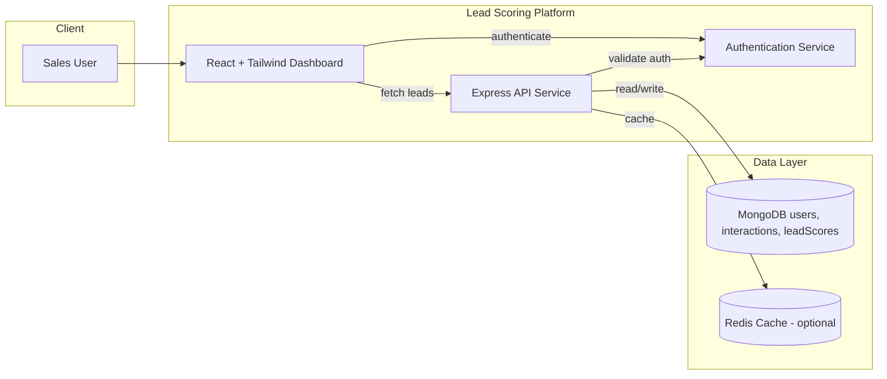

## AI-Powered Lead Scoring Platform — Application Specification

### Executive Summary
AI-Powered Lead Scoring Dashboard prioritizes leads in Nexlify’s CRM using a simple, transparent model based on interaction data. It integrates with existing services and MongoDB, and ships as a React + Tailwind UI with an Express API service.
- Business goal: Demonstrate effective lead scoring capabilities.
- Value: Complete standalone platform with transparent algorithms and actionable insights.
- MVP: Deterministic scoring (weighted sum), user management, cached/persisted in MongoDB, sortable dashboard.

### High-Level Architecture
- Frontend: React (Vite) with Tailwind CSS.
- Backend: Express API service with authentication.
- Database: MongoDB (users, interactions, leadScores).
- Authentication: JWT-based user authentication.
- Caching: Optional Redis for performance optimization.

### Scope
- In scope: React dashboard (sortable table); GET /leads/scoring; weighted-sum scoring; MongoDB read/write; Tailwind.
- Out of scope (MVP): Advanced ML; complex segmentation; websockets; AB tests; full RBAC UI.

### KPIs & Success Metrics
- Primary: Conversion uplift target +15%.
- Secondary: API P95 < 300 ms; TTI < 2.5s; >95% scores fresh within 15m; adoption by sales team.

### Personas & Journeys
- Sales Rep: Sort by score, action top leads.
- Sales Manager: Validate alignment; adjust thresholds.
- RevOps: Monitor data quality/performance.

### Functional Requirements
- LeadScoringDashboard.js
  - Columns: Lead Name, Score, Priority, Email Opens, Website Visits, Time Spent, Last Activity, Owner.
  - Sorting by Score (desc default), then Last Activity; clickable headers.
  - Filters: minScore; ownerId (optional); pagination (page/limit).
  - Refresh button + auto-refresh every 60s; loading/empty/error states; accessibility-compliant table.
- API (GET /leads/scoring)
  - Computes score on-demand or returns cached score; upserts into leadScores.
  - Query: limit (<=200), page (>=1), sort (score:desc|lastActivityAt:desc), minScore, ownerId, includeRaw, refresh.
  - Auth: Bearer JWT; tenant scoping.
  - Rate limited.

### Non-Functional Requirements
- Availability ≥99.9%; P95 <300 ms @ 100 RPS; JWT validation; input validation; structured logging; test coverage.

### Data Model
- users (authentication & ownership)
  - userId, email:string, passwordHash:string, name:string, role:string, createdAt:ISODate, lastLoginAt:ISODate
  - Indexes: {email:1} (unique); {userId:1}
- interactions (lead activity data)
  - userId, leadId, leadName:string, leadEmail:string, emailOpens:number, websiteVisits:number, timeSpent:number(seconds), lastActivityAt:ISODate, updatedAt:ISODate
  - Indexes: {userId:1, leadId:1}; {userId:1, updatedAt:-1}; {userId:1, lastActivityAt:-1}
- leadScores (computed scores)
  - userId, leadId, leadName:string, score:number(0–100), breakdown:{emailOpens, websiteVisits, timeSpent, decayFactor?}, computedAt:ISODate, lastActivityAt:ISODate
  - Indexes: {userId:1, score:-1}; {userId:1, computedAt:-1}; {leadId:1}

### Scoring Algorithm (MVP)
- score_raw = w1*norm(emailOpens) + w2*norm(websiteVisits) + w3*norm(timeSpent)
- score = clamp01(score_raw) * decay(lastActivityAt) * 100
- Normalization caps: emailOpens cap=10 → x/10; websiteVisits cap=20 → x/20; timeSpent cap=600s → x/600 (values min-capped at 0).
- Default weights: w1=0.4, w2=0.35, w3=0.25 (env configurable).
- Time decay: half-life 7 days → decay = 0.5 ^ (days_since_last_activity/7).
- Store score and breakdown; return explainable fields.
- Config (env): LEAD_SCORE_WEIGHTS="0.4,0.35,0.25"; LEAD_SCORE_CAPS="10,20,600"; LEAD_SCORE_DECAY_HALFLIFE_DAYS=7.

### API Design
- GET /leads/scoring
  - Headers: Authorization: Bearer <jwt>
  - Query: limit (default 50, max 200), page (default 1), sort (default score:desc), minScore, ownerId, includeRaw=false, refresh=false
  - Response 200:
    - data: [{ tenantId, leadId, score, breakdown, lastActivityAt, ownerId?, raw? }]
    - meta: { page, limit, sort, minScore, refreshed }
  - Errors: 400 invalid params; 401 unauthorized; 429 rate limited; 500 internal error
- Behavior: Use cached scores if fresh (<= SCORE_FRESHNESS_MINUTES, default 15). If stale/not found or refresh=true → recompute from interactions and upsert. Always filter by tenantId from JWT.

### Front-End (LeadScoringDashboard.js)
- React + Tailwind; SWR for fetching/caching and auto-refresh.
- UI: Filters (minScore, owner); sortable headers; pagination; ScoreBadge; clear alignment for numeric columns.
- Accessibility: Proper table semantics, ARIA sort, focus states.
- Performance: Paginated requests; includeRaw only when needed.

### Deployment & Configuration
- Hosting: Containerized services (Express API and React UI) for local development using Docker Compose. For other environments, deploy to your chosen infra (e.g., Kubernetes or VM).
- Env Vars: MONGODB_URI, MONGODB_DB, JWT_ISSUER/JWKS_URI (or AUTH_SECRET), LEAD_SCORE_WEIGHTS, LEAD_SCORE_CAPS, LEAD_SCORE_DECAY_HALFLIFE_DAYS, SCORE_FRESHNESS_MINUTES=15.
- Secrets via environment variables; local dev via .env and docker-compose.yml; Atlas networking via allowlist/peering.

### Security Considerations
- AuthN: Validate JWT (issuer, audience, signature).
- AuthZ: Tenant scoping; optional ownerId filter.
- Input Validation: Bounds-check query params; sanitize inputs.
- DB Access: Least-privileged role (read interactions; readWrite leadScores).
- PII: Limit to necessary fields; avoid logging PII.
- Rate Limiting: e.g., 60 RPM per user (configurable).

### Observability & Operations
- Structured logs (requestId, anonymized userId, tenantId, latency, DB timings); error logging.
- Metrics: scored leads count, cache hit ratio, stale vs recompute ratio, error rates.
- Optional tracing: OpenTelemetry; slow query logging (>100ms) for index review.

### Testing Strategy
- Unit: Scoring function (weights, caps, decay, rounding, edge cases).
- Integration: API with mongodb-memory-server; cache freshness behavior; filters/sort.
- UI: React Testing Library (sorting toggles, loading/empty/error states); light E2E (Playwright/Cypress) for sort/filter.
- CI: Lint + unit/integration tests on PR; coverage > 90% for scoring module.

### Performance & Scalability
- Query: interactions by tenantId with leadId; simple aggregation for lastActivityAt.
- Indexes: As above; page size capped.
- Caching: Optional Redis TTL = freshness window for top lists.
- Future: Scheduled batch recompute for active leads.

### Risks & Mitigations
- Data freshness drift → short freshness window + background refresh.
- Data quality gaps → show lastActivityAt and "no data" badge; robust defaults.
- Latency spikes → proper indexes; cap page size; degrade to cached scores when compute >300ms.
- Security misconfig → strict JWT validation; least-privileged DB roles; secrets only in env.

### Delivery Plan (30-minute MVP)
- 0–5m: Scaffold Next.js + Tailwind; create components/LeadScoringDashboard.js.
- 5–15m: Implement /api/leads/scoring, Mongo client, scoring function, env config.
- 15–20m: Build table with sorting/filters; SWR data fetching.
- 20–25m: Add minimal unit tests for scoring; API smoke test.
- 25–30m: Configure environment variables; deploy using your chosen platform; manual smoke.

### Open Questions
- Auth source (JWKS/JWT) details? OwnerId source? Tenancy model (shared vs per-tenant DB)? Lead display fields (name/email) source? Freshness target? Secondary sort tie-breaker?

### Future Enhancements
- ML models (logistic regression/GBM); feature flags; AB testing; websockets; CSV export; audit log; explainability view; usage analytics to auto-tune weights.

### Configuration Summary
- MONGODB_URI, MONGODB_DB
- JWT_ISSUER / JWKS_URI (or AUTH_SECRET)
- LEAD_SCORE_WEIGHTS="0.4,0.35,0.25"
- LEAD_SCORE_CAPS="10,20,600"
- LEAD_SCORE_DECAY_HALFLIFE_DAYS=7
- SCORE_FRESHNESS_MINUTES=15

---

# DEVELOPMENT IMPLEMENTATION CHECKLIST

## PHASE 1: FOUNDATION & INFRASTRUCTURE

### 1.1 Project Infrastructure Setup (NEX-67)

#### 1.1.1 Repository Structure
- [ ] Create `services/` directory structure
  - [ ] `services/lead_scoring/` (Express API)
  - [ ] `services/dashboard/` (React UI)
  - [ ] `services/data/` (MongoDB connectors)
- [ ] Create `shared/` directory for common utilities
  - [ ] `shared/types/` (TypeScript type definitions)
  - [ ] `shared/utils/` (Common utility functions)
  - [ ] `shared/config/` (Shared configuration)
- [ ] Create `tests/` directory structure
  - [ ] `tests/unit/` (Unit tests)
  - [ ] `tests/integration/` (Integration tests)
  - [ ] `tests/e2e/` (End-to-end tests)
- [ ] Create `docs/` directory for documentation
- [ ] Create `.github/` directory for CI/CD workflows

#### 1.1.2 TypeScript Configuration
- [ ] Create root `tsconfig.json` with base configuration
- [ ] Create `services/lead_scoring/tsconfig.json` extending base
- [ ] Create `services/dashboard/tsconfig.json` extending base
- [ ] Create `services/data/tsconfig.json` extending base
- [ ] Configure path mapping for shared modules
- [ ] Set up strict TypeScript rules
- [ ] Configure module resolution for monorepo

#### 1.1.3 ESLint & Prettier Configuration
- [ ] Create root `.eslintrc.js` with base rules
- [ ] Configure snake_case naming convention rules
- [ ] Set up functional programming lint rules
- [ ] Create `.prettierrc.js` with formatting rules
- [ ] Create `.eslintignore` and `.prettierignore` files
- [ ] Add lint-staged configuration for pre-commit hooks
- [ ] Configure VSCode settings for consistent formatting

#### 1.1.4 Package Management Setup
- [ ] Create root `package.json` with workspace configuration
- [ ] Set up pnpm workspaces or npm workspaces
- [ ] Create `services/lead_scoring/package.json`
- [ ] Create `services/dashboard/package.json`
- [ ] Create `services/data/package.json`
- [ ] Install shared development dependencies at root
- [ ] Configure scripts for building all services
- [ ] Set up dependency management scripts

#### 1.1.5 Docker Configuration Enhancement
- [ ] Update `docker-compose.yml` with all services
  - [ ] MongoDB service (existing)
  - [ ] Redis service for caching
  - [ ] lead_scoring API service
  - [ ] dashboard UI service
  - [ ] nginx reverse proxy (optional)
- [ ] Create `services/lead_scoring/Dockerfile`
- [ ] Create `services/dashboard/Dockerfile`
- [ ] Create `.dockerignore` files for each service
- [ ] Configure Docker networking between services
- [ ] Set up volume mounts for development
- [ ] Configure environment variable passing

#### 1.1.6 CI/CD Pipeline Setup
- [ ] Create `.github/workflows/ci.yml`
  - [ ] Node.js matrix testing (16.x, 18.x, 20.x)
  - [ ] Install dependencies step
  - [ ] Lint all services step
  - [ ] Type check all services step
  - [ ] Run unit tests step
  - [ ] Run integration tests step
  - [ ] Build all services step
  - [ ] Upload test coverage reports
- [ ] Create `.github/workflows/pr-checks.yml`
- [ ] Configure branch protection rules
- [ ] Set up automated dependency updates (Dependabot)

### 1.2 MongoDB Schemas & Data Service (NEX-68)

#### 1.2.1 Database Schema Design
- [ ] Design `users` collection schema
  - [ ] `userId: ObjectId` (primary key)
  - [ ] `email: string` (unique, indexed)
  - [ ] `passwordHash: string` (bcrypt hashed)
  - [ ] `name: string`
  - [ ] `role: enum['admin', 'user']`
  - [ ] `createdAt: Date`
  - [ ] `lastLoginAt: Date`
  - [ ] `isActive: boolean`
- [ ] Design `interactions` collection schema
  - [ ] `_id: ObjectId` (primary key)
  - [ ] `userId: ObjectId` (foreign key to users)
  - [ ] `leadId: string` (unique per user)
  - [ ] `leadName: string`
  - [ ] `leadEmail: string`
  - [ ] `emailOpens: number` (default 0)
  - [ ] `websiteVisits: number` (default 0)
  - [ ] `timeSpent: number` (seconds, default 0)
  - [ ] `lastActivityAt: Date`
  - [ ] `createdAt: Date`
  - [ ] `updatedAt: Date`
- [ ] Design `leadScores` collection schema
  - [ ] `_id: ObjectId` (primary key)
  - [ ] `userId: ObjectId` (foreign key to users)
  - [ ] `leadId: string`
  - [ ] `leadName: string`
  - [ ] `score: number` (0-100)
  - [ ] `breakdown: object`
    - [ ] `emailOpens: number`
    - [ ] `websiteVisits: number`
    - [ ] `timeSpent: number`
    - [ ] `decayFactor: number`
  - [ ] `computedAt: Date`
  - [ ] `lastActivityAt: Date`

#### 1.2.2 Database Indexes
- [ ] Create indexes for `users` collection
  - [ ] `{ email: 1 }` (unique)
  - [ ] `{ userId: 1 }`
  - [ ] `{ createdAt: -1 }`
- [ ] Create indexes for `interactions` collection
  - [ ] `{ userId: 1, leadId: 1 }` (compound, unique)
  - [ ] `{ userId: 1, updatedAt: -1 }`
  - [ ] `{ userId: 1, lastActivityAt: -1 }`
  - [ ] `{ leadEmail: 1 }`
- [ ] Create indexes for `leadScores` collection
  - [ ] `{ userId: 1, score: -1 }`
  - [ ] `{ userId: 1, computedAt: -1 }`
  - [ ] `{ leadId: 1 }`
  - [ ] `{ userId: 1, leadId: 1 }` (compound, unique)

#### 1.2.3 Data Service Implementation
- [ ] Create `services/data/src/database.ts`
  - [ ] MongoDB connection setup with connection pooling
  - [ ] Database connection error handling
  - [ ] Connection retry logic
  - [ ] Graceful shutdown handling
- [ ] Create `services/data/src/models/user.ts`
  - [ ] User model with Mongoose schema
  - [ ] User validation rules
  - [ ] Password hashing middleware
  - [ ] User query methods
- [ ] Create `services/data/src/models/interaction.ts`
  - [ ] Interaction model with Mongoose schema
  - [ ] Interaction validation rules
  - [ ] Interaction query methods
  - [ ] Bulk update methods
- [ ] Create `services/data/src/models/lead_score.ts`
  - [ ] LeadScore model with Mongoose schema
  - [ ] Score validation rules
  - [ ] Score query methods
  - [ ] Batch scoring methods
- [ ] Create `services/data/src/repositories/user_repository.ts`
  - [ ] `create_user(userData)` method
  - [ ] `find_user_by_email(email)` method
  - [ ] `find_user_by_id(userId)` method
  - [ ] `update_last_login(userId)` method
  - [ ] `deactivate_user(userId)` method
- [ ] Create `services/data/src/repositories/interaction_repository.ts`
  - [ ] `create_interaction(interactionData)` method
  - [ ] `update_interaction(leadId, updates)` method
  - [ ] `find_interactions_by_user(userId, filters)` method
  - [ ] `get_interaction_stats(userId)` method
- [ ] Create `services/data/src/repositories/lead_score_repository.ts`
  - [ ] `upsert_lead_score(scoreData)` method
  - [ ] `find_scores_by_user(userId, filters)` method
  - [ ] `get_stale_scores(freshnessMinutes)` method
  - [ ] `batch_update_scores(scores)` method

#### 1.2.4 Data Validation & Sanitization
- [ ] Create `services/data/src/validators/user_validator.ts`
  - [ ] Email format validation
  - [ ] Password strength validation
  - [ ] Name sanitization
- [ ] Create `services/data/src/validators/interaction_validator.ts`
  - [ ] Lead ID format validation
  - [ ] Email format validation for leads
  - [ ] Numeric field validation (non-negative)
- [ ] Create `services/data/src/validators/score_validator.ts`
  - [ ] Score range validation (0-100)
  - [ ] Breakdown object validation
  - [ ] Date validation

#### 1.2.5 Seed Data Creation
- [ ] Create `services/data/src/seeders/user_seeder.ts`
  - [ ] Create demo admin user
  - [ ] Create demo regular users (3-5)
  - [ ] Hash passwords properly
- [ ] Create `services/data/src/seeders/interaction_seeder.ts`
  - [ ] Generate realistic interaction data
  - [ ] Create 50-100 demo leads per user
  - [ ] Vary interaction patterns for scoring diversity
  - [ ] Set realistic timestamps
- [ ] Create `services/data/src/seeders/index.ts`
  - [ ] Orchestrate seeding process
  - [ ] Check for existing data
  - [ ] Provide seeding CLI command

#### 1.2.6 Data Service Testing
- [ ] Create `tests/unit/data/models/` test files
  - [ ] User model validation tests
  - [ ] Interaction model validation tests
  - [ ] LeadScore model validation tests
- [ ] Create `tests/unit/data/repositories/` test files
  - [ ] User repository CRUD tests
  - [ ] Interaction repository CRUD tests
  - [ ] LeadScore repository CRUD tests
- [ ] Create `tests/integration/data/` test files
  - [ ] Database connection tests
  - [ ] Index creation tests
  - [ ] Seeding process tests
- [ ] Set up mongodb-memory-server for testing
- [ ] Configure test database cleanup

### 1.3 Authentication & Security (NEX-69)

#### 1.3.1 JWT Authentication Setup
- [ ] Create `services/lead_scoring/src/auth/jwt_service.ts`
  - [ ] JWT token generation function
  - [ ] JWT token verification function
  - [ ] Token refresh logic
  - [ ] Token blacklisting support
- [ ] Create `services/lead_scoring/src/auth/password_service.ts`
  - [ ] Password hashing with bcrypt
  - [ ] Password verification function
  - [ ] Password strength validation
  - [ ] Salt generation and management

#### 1.3.2 Authentication Middleware
- [ ] Create `services/lead_scoring/src/middleware/auth_middleware.ts`
  - [ ] JWT token extraction from headers
  - [ ] Token validation and user lookup
  - [ ] Request context population with user data
  - [ ] Error handling for invalid/expired tokens
- [ ] Create `services/lead_scoring/src/middleware/rate_limit_middleware.ts`
  - [ ] Rate limiting by IP address
  - [ ] Rate limiting by user ID
  - [ ] Configurable rate limits
  - [ ] Rate limit exceeded error responses

#### 1.3.3 Authentication Endpoints
- [ ] Create `services/lead_scoring/src/routes/auth_routes.ts`
  - [ ] `POST /auth/register` endpoint
    - [ ] Input validation with Zod
    - [ ] Email uniqueness check
    - [ ] Password hashing
    - [ ] User creation
    - [ ] JWT token generation
  - [ ] `POST /auth/login` endpoint
    - [ ] Input validation with Zod
    - [ ] User lookup by email
    - [ ] Password verification
    - [ ] JWT token generation
    - [ ] Last login timestamp update
  - [ ] `POST /auth/logout` endpoint
    - [ ] Token blacklisting
    - [ ] Session cleanup
  - [ ] `POST /auth/refresh` endpoint
    - [ ] Token refresh logic
    - [ ] New token generation

#### 1.3.4 Input Validation with Zod
- [ ] Create `services/lead_scoring/src/schemas/auth_schemas.ts`
  - [ ] User registration schema
  - [ ] User login schema
  - [ ] Token refresh schema
- [ ] Create `services/lead_scoring/src/schemas/lead_schemas.ts`
  - [ ] Lead scoring query parameters schema
  - [ ] Lead interaction update schema
- [ ] Create validation middleware for automatic schema validation

#### 1.3.5 Security Headers & CORS
- [ ] Configure Helmet middleware for security headers
- [ ] Set up CORS with appropriate origins
- [ ] Configure CSP (Content Security Policy)
- [ ] Set up secure cookie configuration
- [ ] Configure HTTPS redirect in production

#### 1.3.6 Authentication Testing
- [ ] Create `tests/unit/auth/` test files
  - [ ] JWT service tests
  - [ ] Password service tests
  - [ ] Auth middleware tests
- [ ] Create `tests/integration/auth/` test files
  - [ ] Registration endpoint tests
  - [ ] Login endpoint tests
  - [ ] Protected route tests
  - [ ] Rate limiting tests

## PHASE 2: CORE SERVICES

### 2.1 Lead Scoring Algorithm (NEX-70)

#### 2.1.1 Core Scoring Functions
- [ ] Create `services/lead_scoring/src/scoring/score_calculator.ts`
  - [ ] `normalize_email_opens(opens, cap)` function
  - [ ] `normalize_website_visits(visits, cap)` function
  - [ ] `normalize_time_spent(seconds, cap)` function
  - [ ] `calculate_time_decay(lastActivity, halfLifeDays)` function
  - [ ] `calculate_raw_score(interactions, weights)` function
  - [ ] `calculate_final_score(rawScore, decayFactor)` function
- [ ] Create `services/lead_scoring/src/scoring/score_config.ts`
  - [ ] Load scoring weights from environment
  - [ ] Load normalization caps from environment
  - [ ] Load decay parameters from environment
  - [ ] Validate configuration values

#### 2.1.2 Scoring Service Implementation
- [ ] Create `services/lead_scoring/src/services/scoring_service.ts`
  - [ ] `score_single_lead(interaction)` method
  - [ ] `score_multiple_leads(interactions)` method
  - [ ] `get_score_breakdown(interaction)` method
  - [ ] `is_score_fresh(computedAt, freshnessMinutes)` method
- [ ] Implement batch scoring for performance
- [ ] Add scoring result caching logic
- [ ] Create scoring audit trail

#### 2.1.3 Scoring Algorithm Testing
- [ ] Create `tests/unit/scoring/` test files
  - [ ] Normalization function tests
  - [ ] Time decay calculation tests
  - [ ] Score calculation tests with various inputs
  - [ ] Edge case tests (zero values, extreme values)
  - [ ] Configuration validation tests
- [ ] Create performance benchmarks for scoring
- [ ] Test scoring consistency and determinism

### 2.2 Express API Service (NEX-71)

#### 2.2.1 API Server Setup
- [ ] Create `services/lead_scoring/src/app.ts`
  - [ ] Express application setup
  - [ ] Middleware configuration
  - [ ] Route registration
  - [ ] Error handling setup
  - [ ] Graceful shutdown handling
- [ ] Create `services/lead_scoring/src/server.ts`
  - [ ] Server startup logic
  - [ ] Port configuration
  - [ ] Environment-based configuration

#### 2.2.2 Lead Scoring Endpoints
- [ ] Create `services/lead_scoring/src/routes/leads_routes.ts`
  - [ ] `GET /leads/scoring` endpoint
    - [ ] Query parameter validation
    - [ ] User authentication check
    - [ ] Score freshness evaluation
    - [ ] Score calculation or cache retrieval
    - [ ] Pagination implementation
    - [ ] Sorting implementation
    - [ ] Response formatting
  - [ ] `POST /leads/scoring/refresh` endpoint
    - [ ] Force score recalculation
    - [ ] Batch processing support
  - [ ] `GET /leads/:leadId/score` endpoint
    - [ ] Individual lead score retrieval
    - [ ] Score breakdown details

#### 2.2.3 Health Check & Monitoring
- [ ] Create `services/lead_scoring/src/routes/health_routes.ts`
  - [ ] `GET /health` endpoint
    - [ ] Database connectivity check
    - [ ] Redis connectivity check (if enabled)
    - [ ] Service status reporting
  - [ ] `GET /metrics` endpoint (optional)
    - [ ] Performance metrics
    - [ ] Usage statistics

#### 2.2.4 Error Handling & Logging
- [ ] Create `services/lead_scoring/src/middleware/error_middleware.ts`
  - [ ] Global error handler
  - [ ] Error response formatting
  - [ ] Error logging
- [ ] Create `services/lead_scoring/src/utils/logger.ts`
  - [ ] Structured logging setup
  - [ ] Log levels configuration
  - [ ] Request ID tracking

#### 2.2.5 API Testing
- [ ] Create `tests/integration/api/` test files
  - [ ] Lead scoring endpoint tests
  - [ ] Authentication integration tests
  - [ ] Error handling tests
  - [ ] Performance tests
- [ ] Set up API testing with Supertest
- [ ] Create test data fixtures

### 2.3 Caching & Performance (NEX-72)

#### 2.3.1 Redis Caching Implementation
- [ ] Create `services/lead_scoring/src/cache/redis_client.ts`
  - [ ] Redis connection setup
  - [ ] Connection error handling
  - [ ] Cache key generation
- [ ] Create `services/lead_scoring/src/cache/score_cache.ts`
  - [ ] Score caching logic
  - [ ] Cache invalidation strategies
  - [ ] TTL management
  - [ ] Cache hit/miss tracking

#### 2.3.2 Performance Optimization
- [ ] Implement database query optimization
- [ ] Add response compression
- [ ] Implement request/response caching
- [ ] Add performance monitoring
- [ ] Create performance benchmarks

#### 2.3.3 Caching Testing
- [ ] Create cache integration tests
- [ ] Test cache invalidation scenarios
- [ ] Performance impact testing

## PHASE 3: USER INTERFACE

### 3.1 React Dashboard Foundation (NEX-73)

#### 3.1.1 React Application Setup
- [ ] Create `services/dashboard/` with Vite + React + TypeScript
- [ ] Configure Tailwind CSS
- [ ] Set up React Router for navigation
- [ ] Configure state management (Context API or Zustand)
- [ ] Set up SWR for data fetching

#### 3.1.2 Authentication Integration
- [ ] Create authentication context
- [ ] Implement login/logout functionality
- [ ] Add protected route components
- [ ] Handle token storage and refresh

#### 3.1.3 Base Layout & Navigation
- [ ] Create main layout component
- [ ] Implement navigation header
- [ ] Add user profile dropdown
- [ ] Create responsive sidebar (optional)

#### 3.1.4 UI Foundation Testing
- [ ] Set up React Testing Library
- [ ] Create component test utilities
- [ ] Test authentication flows
- [ ] Test navigation components

### 3.2 Lead Scoring Table (NEX-74)

#### 3.2.1 Table Component Implementation
- [ ] Create sortable table component
- [ ] Implement column sorting
- [ ] Add filtering capabilities
- [ ] Implement pagination
- [ ] Add loading and error states

#### 3.2.2 Score Visualization
- [ ] Create score badge component
- [ ] Implement score breakdown display
- [ ] Add score trend indicators
- [ ] Create score distribution charts (optional)

#### 3.2.3 Table Testing
- [ ] Test sorting functionality
- [ ] Test filtering capabilities
- [ ] Test pagination
- [ ] Test responsive behavior

### 3.3 API Integration & Real-time Features (NEX-75)

#### 3.3.1 API Client Setup
- [ ] Create API client with authentication
- [ ] Implement error handling
- [ ] Add request/response interceptors
- [ ] Configure retry logic

#### 3.3.2 Real-time Updates
- [ ] Implement auto-refresh functionality
- [ ] Add manual refresh capability
- [ ] Handle real-time score updates
- [ ] Implement optimistic updates

#### 3.3.3 Integration Testing
- [ ] Test API integration
- [ ] Test real-time features
- [ ] Test error scenarios

## PHASE 4: QUALITY & DEPLOYMENT

### 4.1 Comprehensive Testing (NEX-76)

#### 4.1.1 Unit Testing
- [ ] Achieve >90% test coverage for scoring algorithms
- [ ] Test all utility functions
- [ ] Test React components
- [ ] Test API endpoints

#### 4.1.2 Integration Testing
- [ ] Test database operations
- [ ] Test API integration
- [ ] Test authentication flows
- [ ] Test caching behavior

#### 4.1.3 End-to-End Testing
- [ ] Set up Playwright or Cypress
- [ ] Test complete user workflows
- [ ] Test cross-browser compatibility
- [ ] Test responsive design

#### 4.1.4 Performance Testing
- [ ] Load testing with Artillery or k6
- [ ] Database performance testing
- [ ] API response time testing
- [ ] Frontend performance testing

### 4.2 Production Deployment (NEX-77)

#### 4.2.1 Production Configuration
- [ ] Create production Docker configurations
- [ ] Set up environment variable management
- [ ] Configure production database
- [ ] Set up production caching

#### 4.2.2 Monitoring & Logging
- [ ] Set up application monitoring
- [ ] Configure error tracking
- [ ] Implement health checks
- [ ] Set up log aggregation

#### 4.2.3 Security Hardening
- [ ] Security audit and penetration testing
- [ ] SSL/TLS configuration
- [ ] Security headers validation
- [ ] Dependency vulnerability scanning

### 4.3 Documentation & Handoff (NEX-78)

#### 4.3.1 API Documentation
- [ ] Generate OpenAPI/Swagger documentation
- [ ] Create API usage examples
- [ ] Document authentication flows
- [ ] Create troubleshooting guides

#### 4.3.2 Deployment Documentation
- [ ] Create deployment guides
- [ ] Document environment setup
- [ ] Create backup and recovery procedures
- [ ] Document monitoring and alerting

#### 4.3.3 User Documentation
- [ ] Create user manual
- [ ] Create admin documentation
- [ ] Document configuration options
- [ ] Create FAQ and troubleshooting

---

## IMPLEMENTATION NOTES

### Development Principles
- Follow functional programming patterns
- Use snake_case naming convention
- Implement comprehensive error handling
- Write tests before implementation (TDD)
- Document all public APIs
- Use TypeScript strictly
- Follow security best practices

### Quality Gates
- All tests must pass before merging
- Code coverage must be >90% for core modules
- All linting rules must pass
- Security scans must pass
- Performance benchmarks must be met

### Deployment Checklist
- [ ] All environment variables configured
- [ ] Database migrations applied
- [ ] SSL certificates installed
- [ ] Monitoring configured
- [ ] Backup procedures tested
- [ ] Security audit completed
- [ ] Performance testing completed
- [ ] Documentation updated
